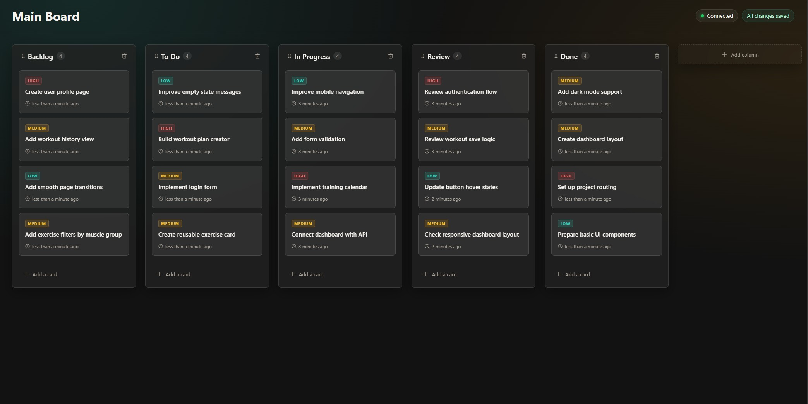
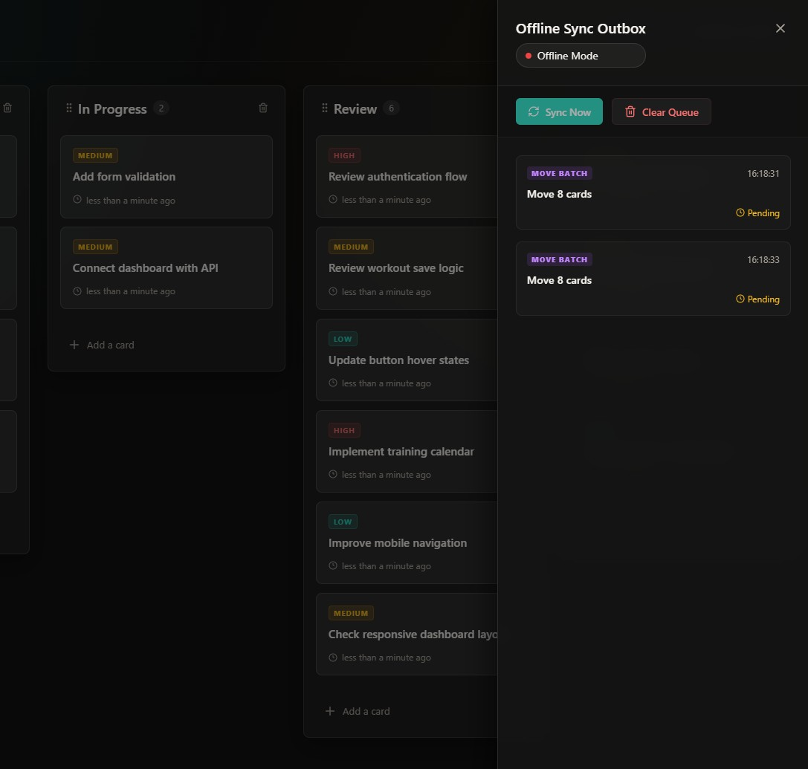
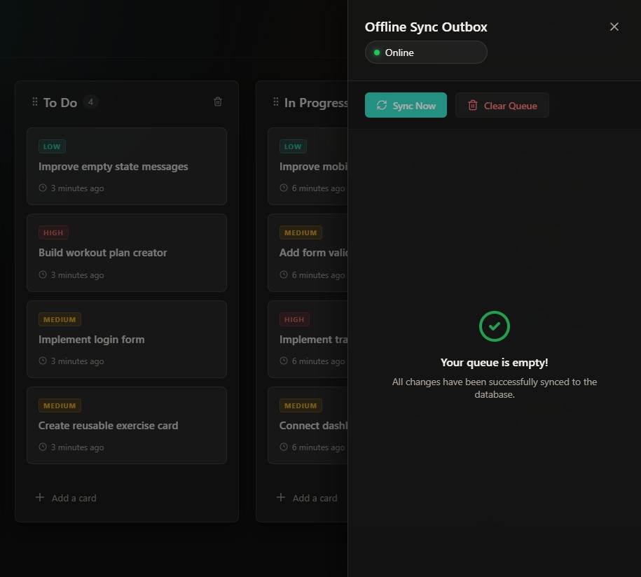

# Real-Time Offline Kanban Board

A portfolio-grade Kanban board built with React, TypeScript, ASP.NET Core, PostgreSQL, SignalR, and IndexedDB. The app supports real-time collaboration events, optimistic updates, and an offline outbox that replays queued changes when the browser comes back online.

## Application Preview

Here is how the application looks and manages real-time offline synchronization:

### 1. Main Kanban Board (Connected)
A responsive dark-mode Kanban interface featuring drag-and-drop card moves, column additions/deletions, and real-time status indicators.


### 2. Offline Synchronization Flow
When connection is lost, mutations are cached locally in an IndexedDB outbox. Once connection is restored, the queue replays to update the database.

| Offline Mode (Pending Outbox Queue) | Online Mode (Synced & Replayed) |
|:---:|:---:|
|  |  |

## Highlights

- Real-time board updates with SignalR groups per board.
- Offline-first client state using IndexedDB and a typed sync outbox.
- Drag-and-drop card moves with atomic batch updates.
- ASP.NET Core API with EF Core migrations and PostgreSQL persistence.
- TypeScript, ESLint, Vitest, xUnit, and build/test scripts for recruiter-friendly verification.

## Tech Stack

- Frontend: React 19, Vite, TypeScript, Zustand, dnd-kit, SignalR client, IndexedDB via `idb`.
- Backend: ASP.NET Core 9, EF Core 9, Npgsql, SignalR, Swashbuckle.
- Tests: Vitest for frontend logic, xUnit for backend domain validation.

## Getting Started

### Backend

1. Start PostgreSQL locally and create a `kanban` database.
2. Configure the connection string in `backend/KanbanBoard.Api/appsettings.Development.json` or with an environment variable:

```powershell
$env:ConnectionStrings__DefaultConnection="Host=localhost;Port=5432;Database=kanban;Username=postgres;Password=postgres"
```

3. Run the API:

```powershell
cd backend
dotnet run --project KanbanBoard.Api
```

The API applies EF Core migrations automatically in Development.

### Frontend

Create `frontend/.env` if you need non-default URLs:

```env
VITE_API_BASE_URL=http://localhost:5212/api
VITE_SIGNALR_URL=http://localhost:5212/hubs/kanban
VITE_BOARD_ID=00000000-0000-0000-0000-000000000001
```

Then run:

```powershell
cd frontend
npm install
npm run dev
```

## Verification

Run these before pushing changes:

```powershell
cd frontend
npm run lint
npm run build
npm test
npm audit --omit=dev

cd ../backend
dotnet build KanbanBoard.sln
dotnet test KanbanBoard.sln
```

## Architecture Notes

The frontend stores board data in normalized Zustand state and persists server snapshots to IndexedDB. User mutations are optimistic: they update local state, write IndexedDB, and enqueue a typed outbox operation. When online, the outbox replays operations against the API.

The backend validates card moves so a batch cannot span boards and cards cannot be moved to columns from another board. SignalR broadcasts the final DTO state to clients subscribed to the affected board group.
